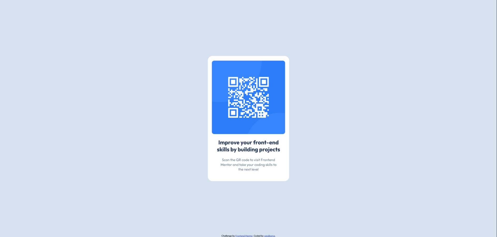

# Frontend Mentor - QR code component solution

This is a solution to the [QR code component challenge on Frontend Mentor](https://www.frontendmentor.io/challenges/qr-code-component-iux_sIO_H). Frontend Mentor challenges help you improve your coding skills by building realistic projects. 

## Table of contents

- [Overview](#overview)
  - [Screenshot](#screenshot)
  - [Links](#links)
- [My process](#my-process)
  - [Built with](#built-with)
  - [What I learned](#what-i-learned)
  - [Continued development](#continued-development)
  - [Useful resources](#useful-resources)
- [Author](#author)

## Overview

### Screenshot

### Links

- Solution URL: <https://github.com/vendkoma/qr-code-component>
- Live Site URL: <https://vendkoma.github.io/qr-code-component/>

## My process

### Built with

- Semantic HTML5 markup
- CSS custom properties
- Flexbox
- Google Fonts API

### What I learned

This is the first time I've used **Git** from start to finish of a project, so a lot of what I've learned in completing it involves the basics of Git workflow. In my first draft, I started with a width that was too large for the QR code card component. This led to using a font size that was larger than what was specified in the style guide, and also caused issues with resizing the page when testing for responsiveness at smaller resolutions. To fix this, I created a Git branch and reworked many of the size values. Removing the extra starter files not needed for the final project, merging the updated branch back into main, and pushing the files back to GitHub all required using Git commands I didn't have much practice with.

Using **Flexbox** to center and format elements on a page is also something I was unfamiliar with, so this project gave me an opportunity to attempt that without getting buried in an overly complex design. I don't know that I was completely successful, but it gave me a better idea of how to use it.

Importing from the **Google Fonts API**, as well as using **CSS variables**, are two other practices I hadn't used much previously, so getting some experience with them was beneficial.

### Continued development

**Media queries** are something I did not utilize in this project, but that would be one of the first improvements I would look to make in the next revision, and I know they will be necessary in most future projects.

When viewed at extremely slim resolutions ( < 350 pixel width) in Chrome's developer tools responsive mode, the edges of the QR card component are flush with the sides of the window (meaning no page background is visible, unlike what's shown in the demo of the mobile design). I attempted to fix this by adding left and right margins to the card, but this didn't seem to have any effect. A possible solution that I did not try would be to add transparent borders to the left and right sides.

The attribution text at the bottom of the page originally would slide to the left of the window as if it was left-aligned when viewed at very slim resolutions. I attempted to center it by setting its left and right margins to auto, and turning it into a block element, but neither of these worked. Per a response to a similar issue found on Stack Overflow, setting a min-width for the body seemed to fix this, although I'm not entirely sure why. I suspect this is a result of the way flex item shrinking works, and it's something I would revisit once I have better understanding.

The text below the QR code image doesn't seem completely perfectly aligned with what's shown in the demo images. For example, in the demos, the word "Mentor" seems to be more to the left, aligned directly below "skills" in the header text above. This is a very minor nitpick though.

**Flexbox** is generally something I would like to get more practice with in the future. It's likely my implementation was not perfect here, which may have contributed to the previous issues.

### Useful resources

- [Pro Git book](https://git-scm.com/book/en/v2) - This helped me generally get more comfortable with using and understanding Git while working on this project.

## Author

- GitHub - [@vendkoma](https://github.com/vendkoma)
- Frontend Mentor - [@vendkoma](https://www.frontendmentor.io/profile/vendkoma)

